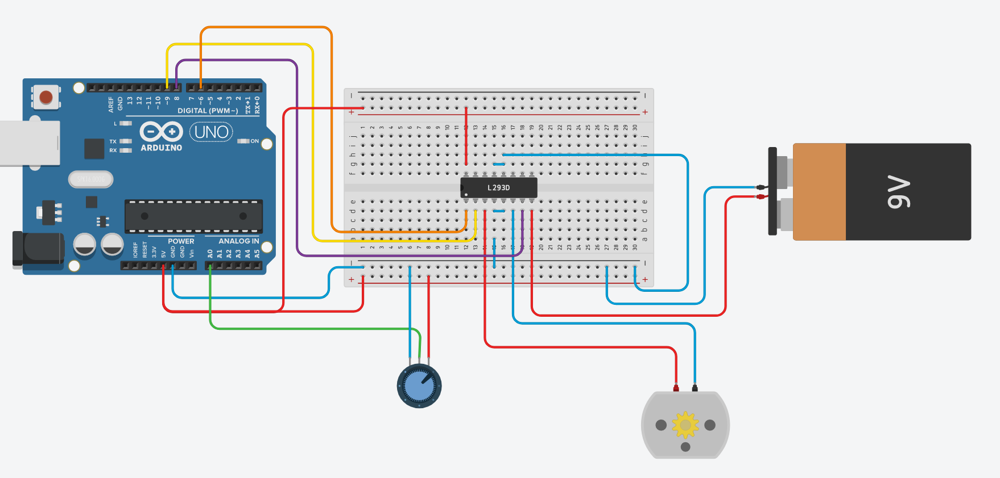

# MotorFader
## Installation
Clone the Repository to your Arduino Library Folder(default Windows: C:\Users\\\<User>\Documents\Arduino\libraries)
```
git clone https://github.com/DavidW475/MotorFader.git
```
## Usage
### Variables
* motor_pin_a first motor pin on the Arduino
* motor_pinb second pin on the Arduino
* enable_pin enable pin on the Arduino
* potentiometer_pin potentiometer_pin on the Arduino
* faderMin the minimum value of the potentiometer
* faderMax the maximum value of the potentiometer
* tolerance the tolerance of the target point (potentiometer value)
* faderSpeed1 fastest fader speed (between 0 and 255)
* faderSpeed2 medium fader speed (between 0 and 255)
* faderSpeed3 low fader speed (between 0 and 255)
* faderSpeedDist1 the potentiometer distance to the target where the fader switches between faderSpeed1 and faderSpeed2
* faderSpeedDist2 the potentiometer distance to the target where the fader switches between faderSpeed2 and faderSpeed3

### Example
#### Example Code
```
#define MOTOR_A_PIN 8
#define MOTOR_B_PIN 9
#define MOTOR_ENABLE_PIN 5
#define POTENTIOMETER_PIN A0
#define BUTTON_NEXT_PIN 6
#define BUTTON_PREVIOUS_PIN 7


#define FADER_MIN 0
#define FADER_MAX 1023
#define TOLERANCE 6
#define FADER_SPEED_1 200
#define FADER_SPEED_2 150
#define FADER_SPEED_3 95
#define FADER_SPEED_DIST_1 600
#define FADER_SPEED_DIST_2 130

#include "MotorFader.h"

MotorFader motorFader(MOTOR_A_PIN, MOTOR_B_PIN, MOTOR_ENABLE_PIN, POTENTIOMETER_PIN, FADER_MIN, FADER_MAX, TOLERANCE, FADER_SPEED_1, FADER_SPEED_2, FADER_SPEED_3, FADER_SPEED_DIST_1, FADER_SPEED_DIST_2);

void setup(){
}

void loop(){
    motorFader.ToPos(50);
    delay(1000);
    motorFader.ToPos(0);
    delay(1000);
    motorFader.ToPos(100);
    delay(1000);
    motorFader.ToPos(25);
    delay(1000);
}
```
#### Example Setup
